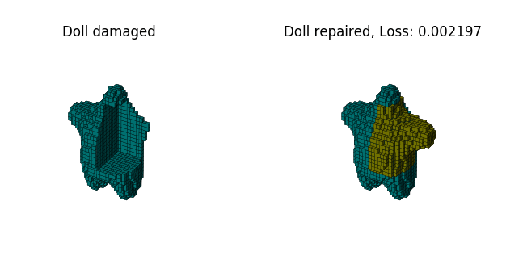
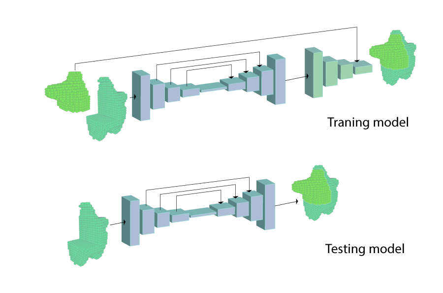
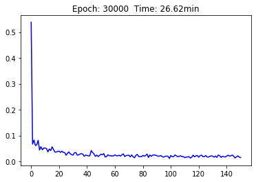

# Reconstruction 3d CGAN

El presente código pretende mostrar los resultados de la primera etapa de un proyecto que tiene como objetivo generar formas tridimensionales con una arquitectura  _generativa adversaria  condicionada_. 
El objetivo de esta etapa era lograr reconstruir un modelo tridimensional que ha sido parcialmente mutilado (hasta un máximo de 50%).  Demostración [aquí](https://github.com/sandroormeno/reconstruction3d_CGAN/blob/master/test.ipynb).

  

Para efecto del entrenamiento y test se genera el efecto mutilado aleatoriamente en una figura tridimensional formateado en binvox con una resolución cubica de 32 vóxeles. El procedimiento para formatear un modelo tridimensional  se explica en el siguiente [git](https://github.com/sandroormeno/Machine-learning-with-3d-objects).

La arquitectura usada es una __CGAN__ que tiene una etapa generadora con una típica estructura de _autoencoder_ con _skip connections_ y una etapa discriminadora a la cual se le introduce, además de la salida generadora, la solución al problema para el entrenamiento. 

 


El proceso de entrenamiento es muy sensible a la complejidad de la geometría. En el gráfico se muestra el valor de pérdida(_Loss_). 


 


La motivación a este proyecto proviene del trabajo de __R. Hermoza__ y __I. Sipiran__ (PUCP) publicado  en el paper: [__3D Reconstruction of Incomplete Archaeological Objects Using a Generative Adversarial Network__](https://arxiv.org/abs/1711.06363). El código lo pueden encontrar [aquí](https://github.com/renato145/3D-ORGAN).


  


```python

```
